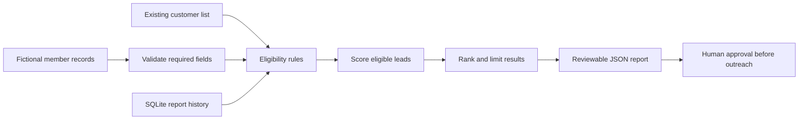

# Python Business Research Pipeline - Nicholas Baccus

I built this project from a real automation problem: a daily research report is only useful if the leads are relevant, repeat entries are controlled, current customers stay excluded, and bad input cannot quietly produce a believable-looking report.

This public version uses fictional companies and contains no customer information, prospect history, credentials, or operational configuration. The point is the engineering approach: validate the input, apply clear business rules, keep durable history, score consistently, and produce an output that can be reviewed before anyone is contacted.

## What it demonstrates

- Python data processing with explicit validation
- SQLite history and a 90-day repeat-report rule
- Existing-customer exclusions
- Explainable lead scoring instead of an unexplained number
- Geographic and industry filters
- Deterministic JSON report generation
- Unit tests for the rules that could cause a costly mistake
- A deliberate separation between research and customer outreach

## How the pipeline works



## Run it

The project uses only the Python standard library.

```bash
python research_pipeline.py \
  --members examples/sample_members.json \
  --customers examples/sample_existing_customers.json \
  --database state/prospects.sqlite3 \
  --output output/daily_report.json \
  --as-of 2026-08-13
```

Run the tests:

```bash
python -m unittest discover -s tests -v
```

## Decisions I made on purpose

**The score is explainable.** Each lead includes the reasons it earned points. If I cannot explain why a record ranked highly, I do not trust the ranking.

**History is part of correctness.** A lead reported within the last 90 days is excluded. That rule lives in SQLite rather than depending on someone remembering what appeared in an old spreadsheet.

**Current customers are blocked early.** The exclusion happens before scoring, so an existing customer cannot accidentally appear just because it has strong growth signals.

**Research does not equal outreach.** This program writes a report. It does not email, text, submit a form, or contact a company. That boundary makes the workflow safer and easier to review.

**Bad records fail closed.** Missing names, unsupported cities, malformed websites, and invalid input shapes are rejected or excluded instead of being guessed at.

## Repository map

```text
research_pipeline.py                  pipeline, validation, scoring, and SQLite history
examples/sample_members.json          fictional research input
examples/sample_existing_customers.json fictional exclusion list
tests/test_pipeline.py                business-rule and regression tests
.github/workflows/python-tests.yml    automated test run
```

## What I would add in a production environment

1. Structured application logging and run identifiers.
2. Retry and timeout policies around approved public-data sources.
3. Schema versioning for incoming records and generated reports.
4. A review dashboard showing why each lead passed or failed.
5. Encrypted secrets supplied by the runtime rather than configuration files.
6. Monitoring for empty reports, unexpected volume, and stale source data.

## About my work

My background is in software test automation, requirements verification, defect analysis, CI/CD, and secure government and defense environments. I tend to favor automation that is understandable, testable, and cautious around external actions. I want a reviewer to be able to follow the rules in this repository without needing me to explain away hidden behavior.

